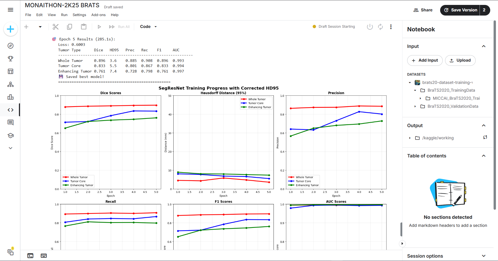

````markdown
# 🧠 BRATS 2020 Brain Tumor Segmentation with MONAI

This repository contains a **baseline 3D UNet pipeline** built using [MONAI](https://monai.io/) for the **BRATS 2020 dataset**.  
It demonstrates preprocessing, training, and visualization workflows for multi-class brain tumor segmentation.  

---

## 📌 Project Overview

- **Task**: Segment brain tumors from 3D MRI scans.  
- **Dataset**: [BRATS 2020](https://www.kaggle.com/datasets/awsaf49/brats20-dataset-training-validation) (369 training cases).  
- **Frameworks**: MONAI + PyTorch.  
- **Model**: Baseline **3D UNet** with Dice Loss.  

---

## ⚙️ Pipeline

1. **Preprocessing**  
   - Spacing, Orientation, Normalization  
   - Random cropping, flips, rotations  
   - Custom augmentations: Gaussian noise  

2. **Training**  
   - 3D UNet (Residual Units)  
   - Dice Loss + Adam Optimizer  
   - Mini-batches on GPU  

3. **Evaluation** (planned)  
   - Sliding window inference  
   - Post-processing (morphological ops, connected components)  
   - Metrics: Dice, Hausdorff95, Sensitivity, Specificity  

4. **Deployment** (planned)  
   - Streamlit/Gradio interactive app  

---

## 🚀 Quick Start (Kaggle)

```bash
!pip install --no-deps monai nibabel -q
````

```python
import monai
print("MONAI:", monai.__version__)
```

1. Add dataset in Kaggle:
   `awsaf49/brats20-dataset-training-validation`
2. Run notebook cells to train & visualize.

---

## 📊 Results & Visualizations

### Training Curve (Loss)



### Sample MRI Slice


### Ground Truth Mask


### Predicted Overlay


*(All images generated from training cases in BRATS 2020)*

---
---
## 🌀 3D Tumor Visualization

We also visualized segmented brain tumors in **3D** using [3D Slicer](https://www.slicer.org/).  
This provides an intuitive view of tumor location, size, and spread across the brain volume.


*(Above: Flair MRI with tumor segmentation overlay in 3D space)*
---

## 🔮 Future Enhancements

* Advanced architectures: **UNet++**, **SegResNet**, **Swin UNETR**.
* Better augmentations (elastic deformation, histogram matching).
* Full evaluation with ROC/PR curves.
* Deploy demo app with Streamlit/Gradio.

---

## 📚 References

* [MONAI Tutorials](https://github.com/Project-MONAI/tutorials)
* [BRATS Challenge](https://www.med.upenn.edu/cbica/brats2020/)
* [PyTorch](https://pytorch.org/)

---

## 👥 Authors

Hackathon Team — *Ctrl+Alt+Heal*

```
```
